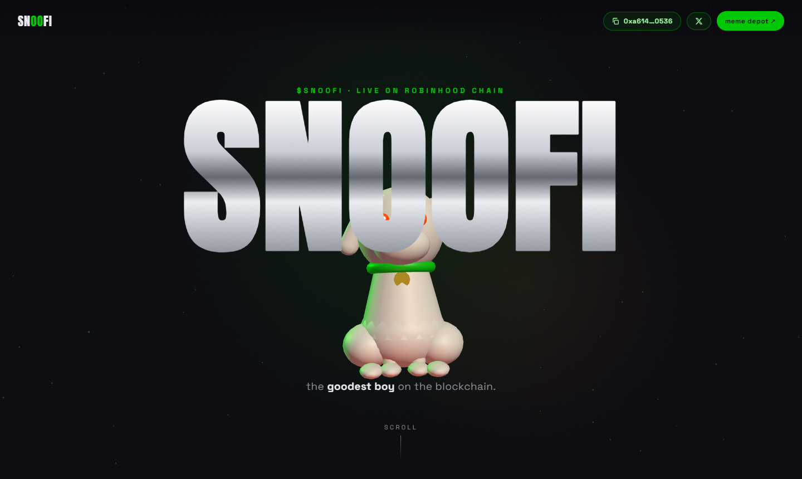

<div align="center">

<a href="https://snoofi.fun"></a>

<br/>
<br/>


<br/>
<br/>

<a href="https://snoofi.fun"></a>&nbsp;
<a href="https://memedepot.com/d/snoofi"></a>&nbsp;
<a href="https://x.com/SnoofiOnRH"></a>

</div>

---

## 🐶 who is snoofi?

a **community-run meme pup** living on robinhood chain. no whitepaper, no promises, no utility — just snoofs, belly rubs, and a pack that never sleeps.

he was a good boy before the chain. he'll be a good boy after it.

---

## 🖼️ the site

<div align="center">

<a href="https://snoofi.fun"></a>

*scroll and he follows. the scrollbar is the leash.*

</div>

the whole page is one scroll story — the 3D pup drifts, does a full show-off spin while his collar lights up robinhood green, then comes in for a close-up with the snoot right in your face.

**psst — click the pup. he likes it.** 🐾

---

## 🗺️ the roadmap

| phase | milestone | status |
|:-----:|-----------|:------:|
| Q1 | be a good boy | ✅ done |
| Q2 | keep being a good boy | 🔄 in progress |
| Q3 | boop??? | 🤞 hopeful |
| Q4 | still a good boy | 🔒 guaranteed |

*that's it. that's the roadmap.*

---

## 📊 dogonomics

| metric | value |
|--------|-------|
| **utility** | none. he's a dog. |
| **whitepaper** | he ate it |
| **team** | the pack |
| **snoot** | boopable ✅ |
| **tail** | wagging at 8 rad/s |
| **CA** | `0xa614c13b18b5c754b34ff51e4775ab19568e0536` |

> ⚠️ always verify the address before you dig — **a good boy sniffs first.**

---

## ⚡ how he's built

<p align="center">
  
</p>

one `index.html`. no build step, no framework, no `node_modules` black hole.

- **[three.js](https://threejs.org/)** — the pup is raw primitives. spheres, capsules, and love. no model files.
- **[gsap scrolltrigger](https://gsap.com/)** — every move he makes is keyed to scroll progress
- **[lenis](https://lenis.darkroom.engineering/)** — buttery smooth scrolling, as the goodest boy deserves

<details>
<summary><b>🔬 the pup, technically</b></summary>
<br/>

| part | implementation |
|------|----------------|
| **body** | tapered cylinder into sphere hips — a dog that actually *sits* |
| **haunches + paws** | mirrored spheres, hind paws splayed like the reddit icon |
| **eyes** | emissive `#FF4500` spheres — they glow in the dark |
| **antenna** | cylinder + ball, wobbling at 3.1 rad/s |
| **the snoot** | raycast target. click it → particle burst + squash-and-stretch boop |
| **collar** | robinhood-green torus with emissive glow, pulses during the on-chain section |
| **choreography** | one gsap timeline scrubbed across the whole page — drift right, cross left with a 360° spin, close-up, sink away |
| **respect** | `prefers-reduced-motion` gets a calm static layout. good boys are considerate. |

</details>

---

## 🏃 run him locally

```bash
git clone https://github.com/gumballchief/snoofi
cd snoofi
npx serve .        # 🐶 he lives at localhost:3000
```

deploy your own:

```bash
npx vercel deploy --prod
```

---

## 🎯 current status

```yaml
snoofi_status:
  mood: goodest
  activity: napping on-chain
  boops_received: uncountable
  treats: accepted
  roadmap: []        # as promised
  promises: []       # also as promised
  vibes: immaculate
```

---

<div align="center">

*"no roadmap. no promises. just snoofs."*

**snoofi is a meme. nothing here is financial advice.**



</div>
